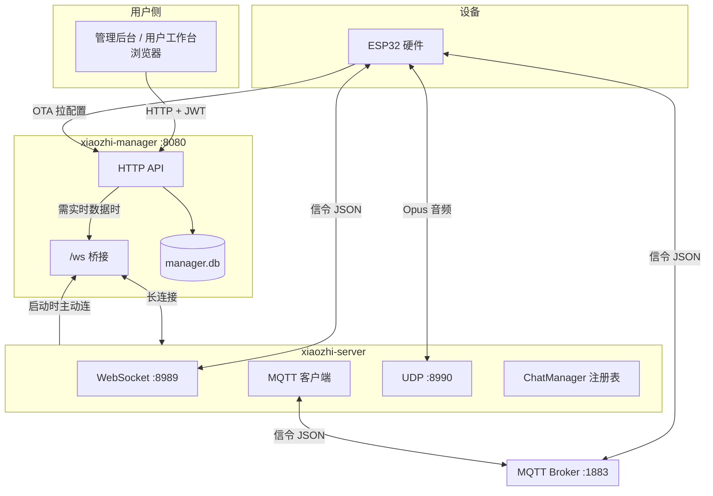
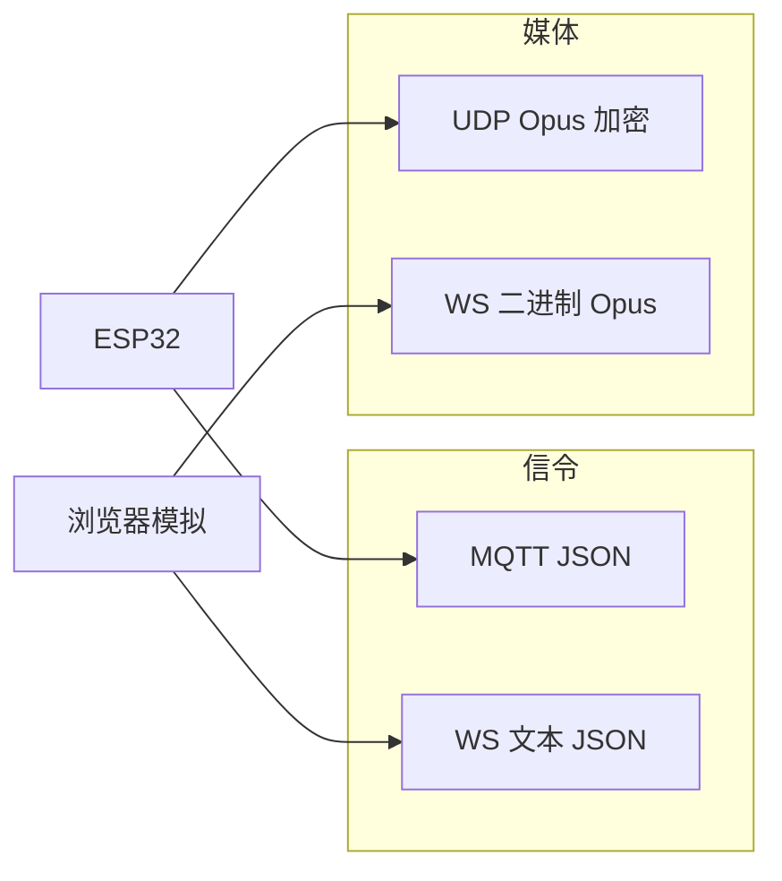
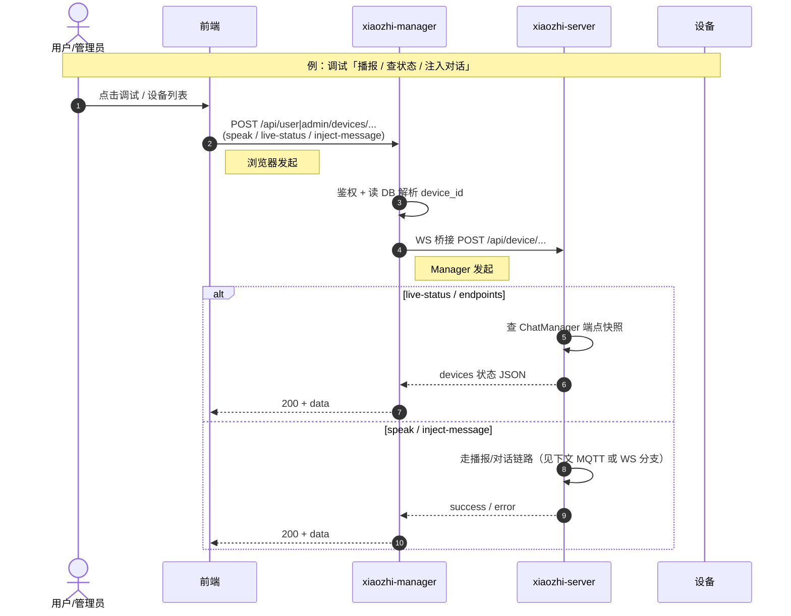
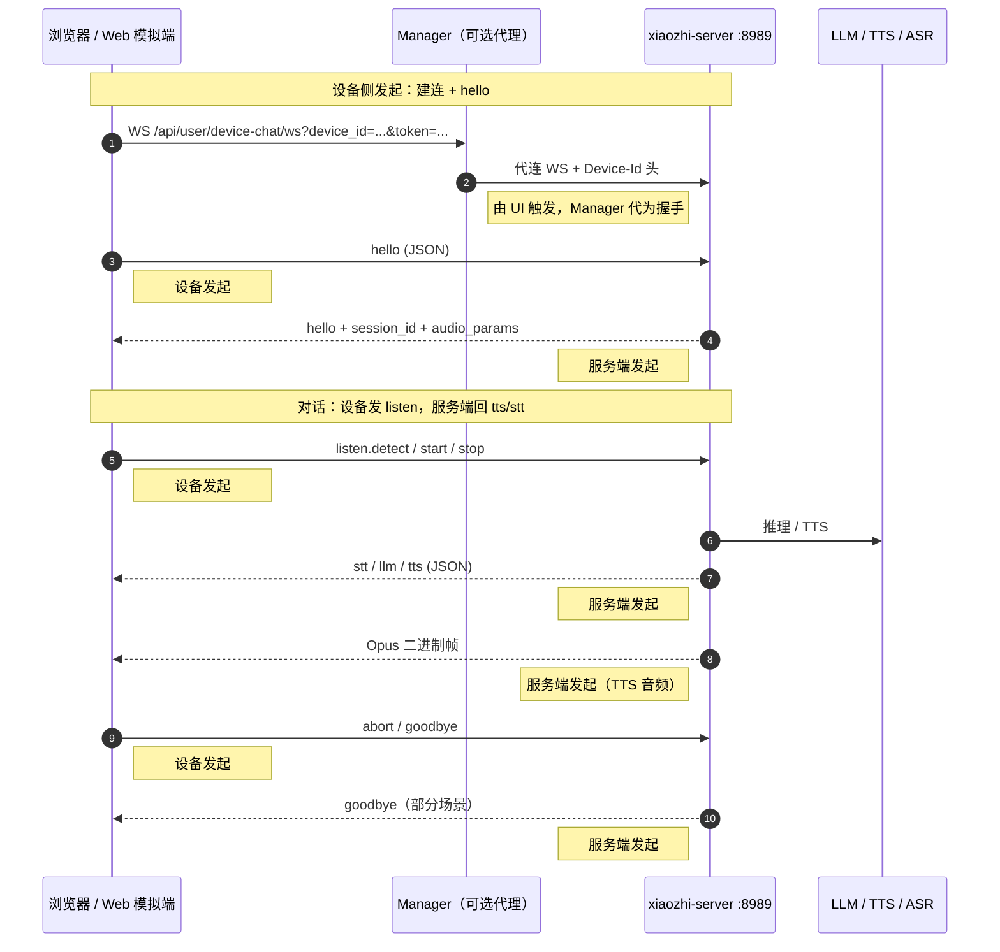
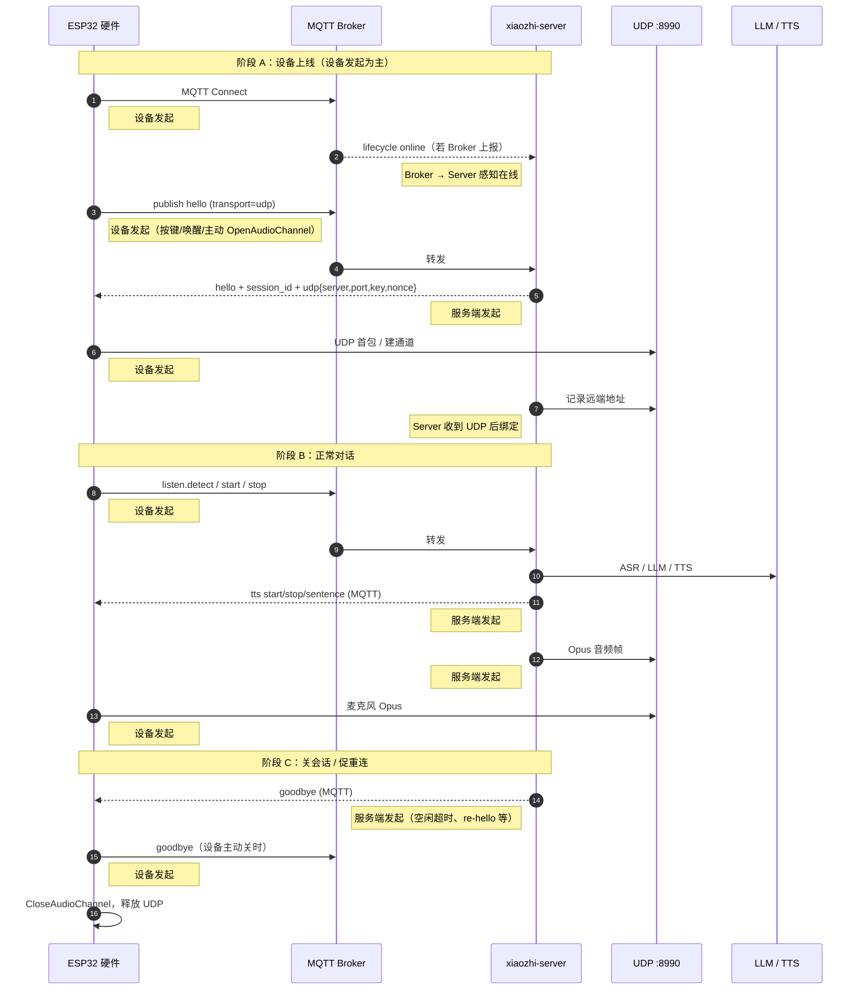
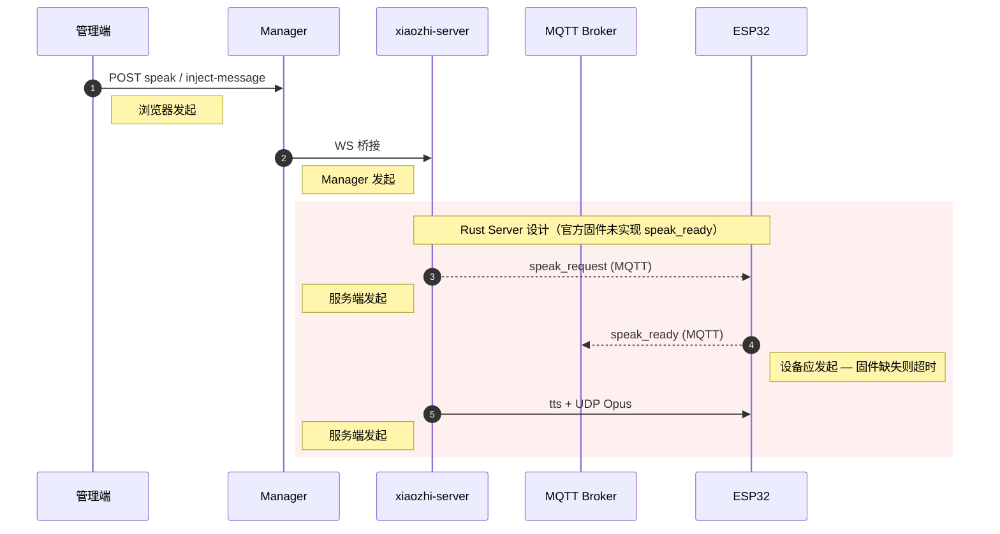
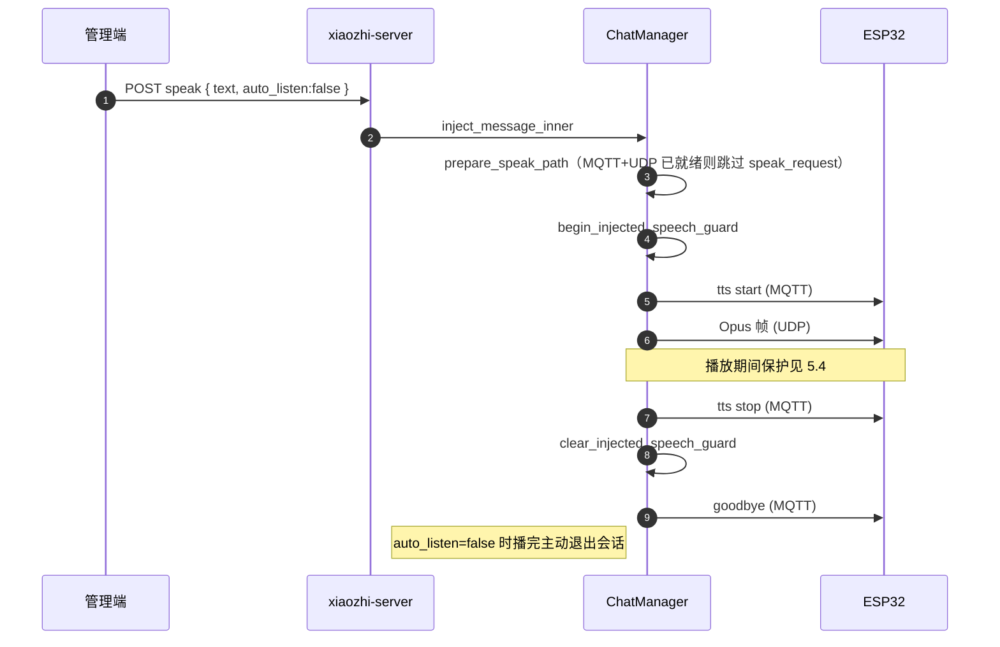
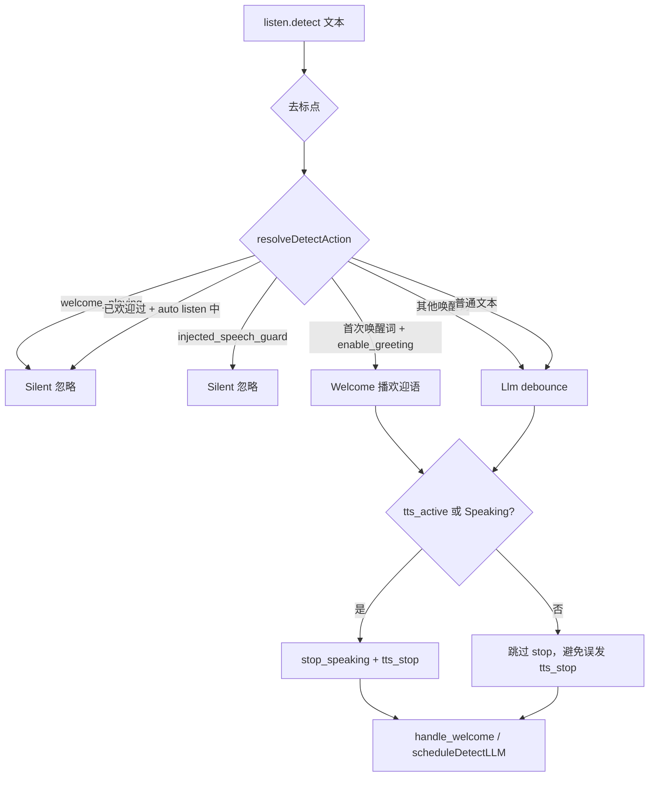
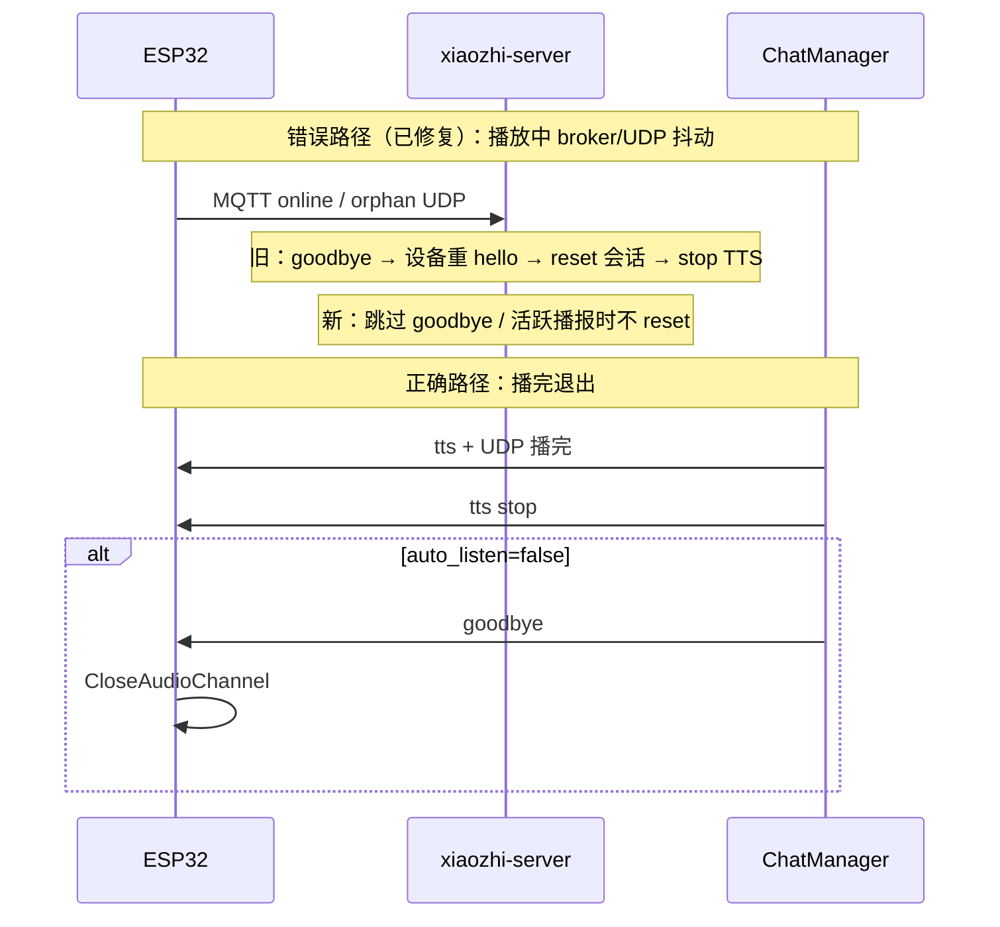
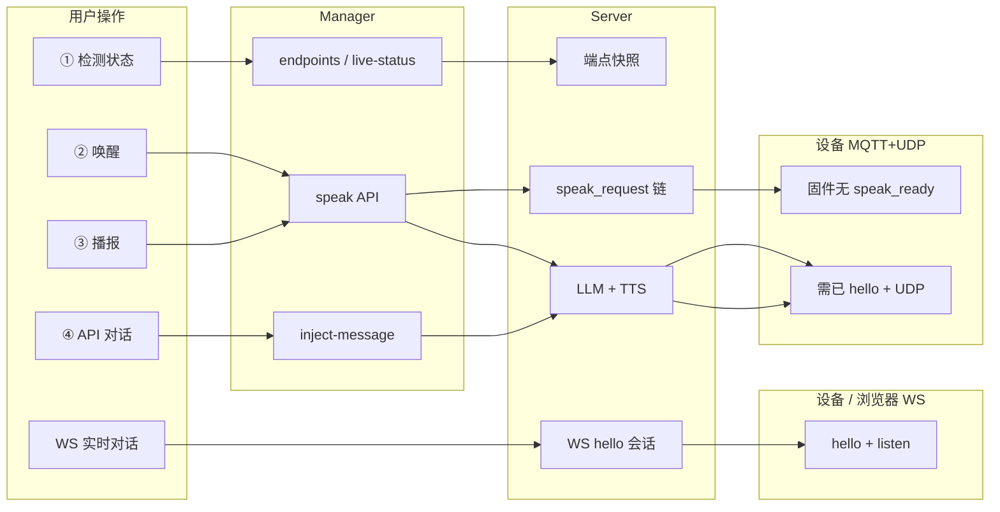

# 设备交互全流程说明（MQTT / WebSocket）

本文描述 **管理后台 / 用户工作台 → xiaozhi-manager → xiaozhi-server → 设备** 的完整交互，并区分 **MQTT+UDP 硬件** 与 **WebSocket** 两条路径的差异。

> 硬件固件参考：`D:\code\xiaozhi-esp32`（官方 ESP32 固件）。  
> Rust 服务端：`xiaozhi-manager`（HTTP :8080 + `/ws` 桥接）、`xiaozhi-server`（WS :8989、MQTT 客户端、UDP :8990）。

**图例**

| 符号 | 含义 |
|------|------|
| **设备发起** | ESP32 / 浏览器模拟端主动建连、hello、listen、goodbye 等 |
| **服务端发起** | Manager 或 xiaozhi-server 主动下发信令 / 音频 / 唤醒 |

---

## 1. 总览：角色与通道



**要点**

- 浏览器只与 **Manager** 通 HTTP；需要查端点、播报、注入对话时，Manager 经 **WebSocket 桥接** 问 **xiaozhi-server**。
- **xiaozhi-server** 启动后 **主动连接** Manager 的 `/ws`（非设备连接 Manager WS）。
- 硬件 OTA 配置来自 Manager；运行时对话信令走 **MQTT**，音频走 **UDP**。
- Web 模拟器 / 纯 WS 设备：信令与音频均在 **一条 WebSocket** 上，不经 MQTT/UDP。

---

## 2. 通道分层与协议约定

**信令**：小体积 JSON 控制消息（建会话、听、播、挂断）。  
**媒体**：连续音频流（Opus），体积大、要求低延迟。

硬件（ESP32）使用 **两条物理通道**：MQTT 传信令 + UDP 传音频。  
Web 模拟器使用 **一条 WebSocket**：同连接上既有 JSON 信令，也有二进制音频。

### 2.0 通道总览

| # | 名称 | 协议 | 默认端口 | 连接方向 | 载荷类型 | 典型用途 |
|---|------|------|---------|----------|----------|----------|
| A | **Manager HTTP** | HTTP/1.1 + JWT | `:8080` | 浏览器 → Manager | JSON | 管理后台 API、调试 speak/inject |
| B | **Manager↔Server 桥接** | WebSocket | `:8080/ws` | Server **主动连** Manager | JSON 请求/响应 | Manager 代调 Server 内部 API |
| C | **OTA** | HTTP POST | `:8989` | 设备 → Server | JSON | 拉 WS/MQTT/UDP 地址、激活码 |
| D | **MQTT 信令** | MQTT 3.1.1 | `:1883` | 设备 ↔ Broker ↔ Server | JSON | hello、listen、tts、goodbye |
| E | **UDP 音频** | UDP + AES-CTR | `:8990` | 设备 ↔ Server **直连** | 加密 Opus | 麦克风上行、TTS 下行 |
| F | **设备 WebSocket** | WebSocket | `:8989/xiaozhi/v1/` | 设备/模拟器 → Server | JSON + 二进制 Opus | Web 模拟对话（无 MQTT/UDP） |
| G | **用户模拟 WS 代理** | WebSocket | `:8080/api/user/device-chat/ws` | 浏览器 → Manager → Server | 同上 | 工作台里「实时对话」 |



---

### 2.1 Manager HTTP API（通道 A）

**Base URL**：`http://<manager-host>:8080`  
**鉴权**：`Authorization: Bearer <JWT>`（`/internal/*`、`/setup/*` 等除外）

与设备调试、播报相关的接口（`{id}` 为 **数据库主键**，非 MAC）：

| 方法 | 路径 | 请求体（JSON） | 说明 |
|------|------|----------------|------|
| `GET` | `/api/user/devices/{id}/endpoints` | — | 单设备端点快照（经桥接 B 问 Server） |
| `POST` | `/api/user/devices/live-status` | `{ "device_ids": ["e8:f6:0a:89:b4:0c", ...] }` | 批量在线/端点（**必须 POST**） |
| `POST` | `/api/user/devices/{id}/speak` | 见下表 `SpeakBody` | TTS 播报 / 调试「唤醒」 |
| `POST` | `/api/user/devices/inject-message` | 见下表 `InjectBody` | 注入对话（可走 LLM） |
| `GET` | `/api/user/device-chat/ws` | Query: `device_id`, `token` | Web 模拟器 WS（通道 G） |

管理员路径将 `/api/user/` 换为 `/api/admin/` 即可（如 `/api/admin/devices/{id}/speak`）。

**`SpeakBody`（speak / 唤醒）**

```json
{
  "text": "你好",
  "target": "hardware_first",
  "auto_listen": false
}
```

| 字段 | 类型 | 默认 | 说明 |
|------|------|------|------|
| `text` | string | — | 播报文本（也可用 `message` 字段） |
| `target` | string | `hardware_first` | 端点选择策略（优先 MQTT 硬件） |
| `auto_listen` | bool | `false` | 播完后是否进入自动聆听；`false` 时 Server 播完发 `goodbye` |

**`InjectBody`（inject-message / API 对话）**

```json
{
  "device_id": "e8:f6:0a:89:b4:0c",
  "message": "今天天气怎么样？",
  "skip_llm": false,
  "auto_listen": true,
  "target": "hardware_first"
}
```

| 字段 | 类型 | 默认 | 说明 |
|------|------|------|------|
| `device_id` | string | — | 设备 MAC（冒号格式） |
| `message` | string | — | 用户话术 |
| `skip_llm` | bool | `false` | `true` = 仅 TTS，不经过 LLM |
| `auto_listen` | bool | `false` | 播完后是否 auto listen |
| `target` | string | `""` | 端点策略，空则 Server 默认 |

**响应**：统一 `{ "code": 0, "data": { ... } }`；失败时 `data.error` / `success: false`。若 Server 未连 Manager 桥接，`live-status` 可能返回 `server_connected: false`。

---

### 2.2 Manager ↔ Server 桥接（通道 B）

| 项 | 值 |
|----|-----|
| URL | `ws://<manager>:8080/ws` |
| 方向 | **xiaozhi-server 启动后主动连接** Manager（非设备连接） |
| 帧格式 | JSON：`{ "id", "method", "path", "body" }` → `{ "id", "status", "body", "error" }` |

Manager 将通道 A 的部分请求 **转发** 到 Server 内部路径：

| 桥接方法 | Server 路径 | 用途 |
|----------|-------------|------|
| `POST` | `/api/device/speak` | 播报（body 含 `device_id`, `text`, `target`, `auto_listen`） |
| `POST` | `/api/device/inject_msg` | 注入对话 |
| `POST` | `/api/device/endpoints` | 单设备端点 |
| `POST` | `/api/device/endpoints/batch` | 批量端点 |

实现：`crates/xiaozhi-manager/src/handlers/ws.rs`、`crates/xiaozhi-server/src/bridge/dispatcher.rs`。

---

### 2.3 OTA HTTP（通道 C）

设备冷启动或定期向 Server 拉运行时配置。

| 项 | 值 |
|----|-----|
| URL | `POST http://<server>:8989/xiaozhi/ota/` |
| 请求头 | `Device-Id: e8:f6:0a:89:b4:0c`、`Client-Id: <uuid>` |
| 请求体 | 设备 `system info` JSON（`OtaRequest`，字段较多，服务端只解析常用项） |

**响应 `OtaResponse` 主要字段**

| 字段 | 说明 |
|------|------|
| `websocket.url` | WebSocket 地址，如 `ws://192.168.3.46:8989/xiaozhi/v1/` |
| `websocket.token` | WS 可选 token |
| `mqtt` | `endpoint`, `client_id`, `username`, `password`, `publish_topic`, `subscribe_topic` |
| `server_time` | 时间同步 |
| `firmware` | 固件版本/下载 URL |
| `activation` | 未激活时的激活码（可选） |

MQTT `client_id` 常见格式：`GID_test@@@e8_f6_0a_89_b4_0c@@@<uuid>`（中间段为 **下划线 MAC**）。

---

### 2.4 MQTT 信令（通道 D）

#### Topic 约定

| 方向 | Topic 模式 | 示例（MAC `e8:f6:0a:89:b4:0c`） | QoS | 内容 |
|------|-----------|----------------------------------|-----|------|
| Server → 设备 | `/p2p/device_sub/{mac_underscore}` | `/p2p/device_sub/e8_f6_0a_89_b4_0c` | AtMostOnce | `ServerMessage` JSON |
| 设备 → Server | `/p2p/device_public/{mac_underscore}` 或含 `@@@` 的 GID 形式 | `/p2p/device_public/e8_f6_0a_89_b4_0c` | AtMostOnce | `ClientMessage` JSON |
| Broker → Server | `/p2p/device_public/_server/lifecycle` | 固定 | AtMostOnce | 设备 MQTT 上下线事件 |

**MAC 规则**：设备 ID 冒号 `:` 在 Topic 中换成下划线 `_`（`xiaozhi-protocol::mqtt`）。

**Server 订阅**：`/p2p/device_public/#`（收所有设备上行信令 + lifecycle）。

#### 生命周期事件 `MqttLifecycleEvent`

```json
{
  "type": "mqtt_lifecycle",
  "device_id": "e8:f6:0a:89:b4:0c",
  "state": "online",
  "client_id": "GID_test@@@e8_f6_0a_89_b4_0c@@@...",
  "ts": 1782890042247
}
```

`state`：`online` | `offline`。  
注意：**MQTT 在线 ≠ UDP 音频通道已建立**（还须 `hello` 握手）。

---

### 2.5 UDP 音频（通道 E）

在 **MQTT `hello` 成功** 后，Server 在 hello 应答里下发 `udp{ server, port, key, nonce }`；设备与 Server `external_host:external_port`（默认 `:8990`）**直连**。

#### 包格式（16 字节头 + AES-128-CTR 密文）

与 ESP32 `mqtt_protocol.cc` 使用相同包格式（`xiaozhi-transport::udp`）：

```
偏移  长度  字段
0     1     type        固定 0x01（音频）
1     1     flags
2     2     payload_len  BE，Opus 字节数
4     4     ssrc        BE，即 conn_id / 会话 ID
8     4     timestamp   BE
12    4     sequence    BE，递增
16    N     payload     AES-CTR 加密后的 Opus
```

| 概念 | 说明 |
|------|------|
| `conn_id` / `ssrc` | hello 时生成，绑定 `conn_map`；hello 轮换后旧 ssrc 的包称 **orphan UDP** |
| `key` / `nonce` | hello 应答中的十六进制字符串，解码后作为 AES 密钥与 nonce 模板 |
| 上行 | 设备麦克风 Opus → Server 解密 → ASR |
| 下行 | Server TTS Opus → 加密 → 设备播放 |

**音频参数**（hello 中 `audio_params`，默认）：`format=opus`, `sample_rate=16000`, `channels=1`, `frame_duration=60`（毫秒）。

---

### 2.6 设备 WebSocket（通道 F）

| 项 | 值 |
|----|-----|
| URL | `ws://<server>:8989/xiaozhi/v1/`（OTA 下发） |
| 握手头 | `Device-Id`（必填）、`Protocol-Version`（可选，默认 `1`） |

#### 文本帧：JSON 信令

与 MQTT 共用同一套 `ClientMessage` / `ServerMessage` 结构（见 §2.7），`transport` 为 `"websocket"`。

#### 二进制帧：Opus 音频

由 `Protocol-Version` 决定帧封装（`xiaozhi-protocol::binary_audio`）：

| 版本 | 说明 |
|------|------|
| `1` | **裸 Opus**，无额外头 |
| `2` | 16 字节头：`version(2) + reserved(2) + reserved(4) + timestamp(4) + payload_size(4)` + Opus |
| `3` | 4 字节头：`type(1) + reserved(1) + payload_size(2)` + Opus |

设备上行、Server 下行 TTS 均使用同一协商版本打包/解包。

---

### 2.7 JSON 信令消息字典（MQTT 与 WS 共用）

类型常量定义于 `xiaozhi_core::message`；结构体见 `xiaozhi-protocol::messages`。

#### 设备 → Server（`ClientMessage`）

| `type` | 常用字段 | 含义 |
|--------|----------|------|
| `hello` | `transport`: `"udp"` / `"websocket"`, `audio_params`, `features` | 请求建会话；MQTT 路径须带 `transport=udp` |
| `listen` | `state`: `start`/`stop`/`detect`, `mode`: `auto`/`manual`/`realtime`, `text`（detect 时） | 开始/停止聆听；detect 为唤醒词/前导文本 |
| `abort` | — | 打断当前播放 |
| `goodbye` | `session_id` | 设备主动结束会话 |
| `speak_ready` | `session_id`, `udp_config` | 响应远程 `speak_request`（**官方固件未实现**） |
| `iot` | `payload` | IoT 状态上报 |
| `mcp` | `payload` | 设备 MCP JSON-RPC |

**`listen` 示例**

```json
{ "type": "listen", "state": "start", "mode": "auto", "session_id": "..." }
{ "type": "listen", "state": "detect", "text": "你好小智" }
{ "type": "listen", "state": "stop" }
```

#### Server → 设备（`ServerMessage`）

| `type` | 常用字段 | 含义 |
|--------|----------|------|
| `hello` | `session_id`, `transport`, `audio_params`, `udp` | 应答会话；MQTT 时带 `udp{server,port,key,nonce}` |
| `tts` | `state`: `start`/`stop`/`sentence_start`/`sentence_end`, `text` | 播放控制；**先** `start` 信令，**再** UDP/WS 推 Opus，**最后** `stop` |
| `stt` | `text` | 识别结果（可选展示） |
| `llm` | `text` | 模型流式文本 |
| `goodbye` | `session_id` | 结束会话，设备应 `CloseAudioChannel` |
| `speak_request` | `text`, `session_id`, `auto_listen` | 远程唤醒请求（**固件未实现 speak_ready 时易超时**） |
| `mcp` | `payload` | 下发 MCP 调用 |
| `text` | `text` | 纯文本提示 |

**`hello` 应答示例（MQTT）**

```json
{
  "type": "hello",
  "session_id": "a72a3d29-f771-4a4e-9f51-4896618bcb5b",
  "transport": "udp",
  "audio_params": { "format": "opus", "sample_rate": 16000, "channels": 1, "frame_duration": 60 },
  "udp": {
    "server": "192.168.3.46",
    "port": 8990,
    "key": "<32 hex chars>",
    "nonce": "<32 hex chars>"
  }
}
```

**典型会话信令顺序（MQTT+UDP，本地唤醒）**

```
设备 --hello--> Server --hello+udp--> 设备
设备 --listen detect "你好小智"--> Server --tts start--> 设备
Server --UDP Opus 帧--> 设备
Server --tts stop--> 设备
（可选）Server --goodbye--> 设备
```

---

## 3. 管理端操作（公共 HTTP 层）

适用于：设备列表、调试抽屉、语音通知、`live-status`、`speak`、`inject-message` 等。  
**请求/响应字段与桥接路径详见 §2.1、§2.2。**



| 步骤 | 发起方 | 说明 |
|------|--------|------|
| HTTP 请求 | **浏览器** | 需 JWT；`live-status` 为 **POST**，非 GET |
| WS 桥接请求 | **Manager** | 无已连接 xiaozhi-server 时返回 `server_connected: false` |
| 查端点 / 播报 | **Server** 处理 | 不经过设备确认（只读内存注册表或下发信令） |

**相关 API**

| 接口 | 方法 | 作用 |
|------|------|------|
| `/api/user/devices/live-status` | POST | 批量查会话端点（经 Server WS 桥接） |
| `/api/user/devices/{id}/endpoints` | GET | 单设备端点 |
| `/api/user/devices/{id}/speak` | POST | TTS 播报 |
| `/api/user/devices/inject-message` | POST | 注入对话（可走 LLM） |
| `/api/user/device-chat/ws` | WS | 用户侧 Web 模拟对话（Manager 代理到 Server） |

---

## 4. WebSocket 路径（浏览器模拟器 / WS 设备）

**协议细节见 §2.6、§2.7。** 特点：

- 信令 + 音频 **同一条 WebSocket**（默认 Server `:8989`，用户模拟经 Manager 代理）。
- **无** UDP；**无** `speak_request` / `speak_ready` 唤醒链。
- 管理端「远程唤醒空闲硬件」**不适用**此路径；需客户端已连接。



| 消息类型 | 方向 | 发起方 |
|----------|------|--------|
| `hello` | 设备 → Server | **设备** |
| `hello` 应答 + `session_id` | Server → 设备 | **服务端** |
| `listen.*` | 设备 → Server | **设备** |
| `tts` / `stt` / `llm` / `mcp` | Server → 设备 | **服务端** |
| Opus 二进制 | Server → 设备 | **服务端** |
| `goodbye` | 双向 | 视场景 |

---

## 5. MQTT + UDP 路径（ESP32 硬件）

**MQTT Topic、UDP 包格式、消息字典见 §2.4、§2.5、§2.7。** 特点：

- **MQTT**：JSON 信令。
- **UDP**：Opus 音频（TTS 下行、麦克风上行）。
- 会话须设备 **主动 hello** 后才有 UDP 通道。
- Rust Server 支持 **`speak_request` → `speak_ready`** 远程唤醒；**当前官方 ESP32 固件未实现** `speak_request` / `speak_ready`（仅处理 `hello`、`goodbye`，其余走 `application.cc` 的 tts/listen 等）。

### 5.1 正常上线与对话



### 5.2 管理端「远程播报」— Rust 设计 vs 当前固件



**固件现状（`xiaozhi-esp32`）**

- `mqtt_protocol.cc` 仅显式处理：`hello`、`goodbye`。
- `application.cc` 处理：`tts`、`stt`、`llm`、`mcp`、`system`、`alert` 等。
- **无** `speak_request` / `speak_ready` → 管理端调试「② 唤醒」会 **等待 speak_ready 超时**。
- 设备空闲后远程播报：须用户 **按键/唤醒词** 先 `hello` 建 UDP，或扩展固件实现 speak 链路。

### 5.3 热链路：UDP 已建立时的远程播报（不依赖 speak_ready）

当设备 **已 hello 且 UDP 通道活跃** 时，管理端 `speak`（`skip_llm: true`、`auto_listen: false`）可走 **注入播报** 路径，**不必** 等 `speak_ready`：



| 条件 | 行为 |
|------|------|
| MQTT 在线 + UDP 已绑定 | 直接 `tts start` + UDP 推流 |
| 无 UDP / 冷启动 | 发 `speak_request`，等 `speak_ready`（**固件未实现则超时**） |
| `auto_listen: false` | 播完 `TtsTurnEndPolicy::GoodbyeAndIdle` → 下发 `goodbye` |

相关代码：`crates/xiaozhi-chat/src/manager.rs`（`inject_message_inner`）、`speak_path.rs`。

### 5.4 本地唤醒（detect）与欢迎语

设备在 **listen.detect** 里上报前导文本（如「你好小智」），服务端 `HandleListenDetect` 决策：



| 场景 | 服务端行为 |
|------|-----------|
| 首次说唤醒词 | `Welcome` → 欢迎语 TTS |
| 欢迎语播放中 | `welcome_playing` → 忽略后续 detect / **忽略 auto listen start** |
| 远程注入播报中 | `injected_speech_guard` → **忽略 detect 与 auto listen start** |
| 有残留 TTS 再唤醒 | 仅此时 `stop_speaking`，再播欢迎语或进 LLM |

**典型故障「唔~」一声**：空闲时仍 `stop_speaking` 会向设备发 `tts_stop`，截断正在播或刚起的音频；或远程播报时本地 detect 抢占。修复后仅在 `tts_active \|\| Speaking` 时 stop，注入期间忽略 detect。

相关代码：`session.rs`（`handle_listen_detect`、`handle_listen_start`）、`detect.rs`。

### 5.5 播报保护与 MQTT 会话稳定性

TTS 播放中，服务端会 **避免** 以下操作打断音频：

| 保护点 | 条件 | 行为 |
|--------|------|------|
| `should_protect_active_speak_flow` | `injected_speech_guard` / 待完成 `speak_request` / 对话活跃 | `transport_ready` **不** `reset_to_silent_state` |
| `should_preserve_udp_session_on_hello` | TTS 播放中收到 duplicate hello | **不** 轮换 UDP 会话 |
| `should_ignore_listen_start_during_welcome` | `welcome_playing` + mode≠realtime | 忽略设备自发 `listen start` |
| `should_ignore_listen_start_during_injected_speech` | `injected_speech_guard` + mode≠realtime | 忽略设备自发 `listen start`（固件 tts start 后 ~4s 常见） |
| orphan UDP 包 | SSRC 与当前会话不一致 | **仅打日志**，不下发 `goodbye`（旧逻辑会每 30s 踢设备导致断播） |
| broker 在线但无 UDP | 设备 MQTT 在线尚未 hello | **不下发** `goodbye` 促重连（避免播放中被踢） |



相关代码：`speak_path.rs`、`mqtt_service.rs`、`tts_turn_policy.rs`。

### 5.6 调试时常见日志对照

| 日志关键词 | 含义 | 是否正常 |
|-----------|------|---------|
| `detect recv ... action=Welcome` | 本地唤醒词触发欢迎语 | 本地唤醒时预期 |
| `主动注入播报中，忽略 detect` | 远程播报保护生效 | 远程+本地同时触发时预期 |
| `欢迎语播放中，忽略 listen start` | 欢迎语保护 | 预期 |
| `stop speaking ... HandleListenDetect` | detect 前清空残留输出 | **仅** `tts_active` 时应有 |
| `runSenderLoop interrupt` | TTS 队列被中断 | 若紧跟 Welcome 且此前无播报应排查 |
| `HandleWelcome natural end` | 欢迎语自然播完 | 预期 |
| `ResetToSilentState` / 音频空闲超时 | 30s 无语音活动收会话 | `auto` 模式预期 |
| `orphan UDP 包，等待设备 hello` | 旧 UDP 包，不踢设备 | 重启 Server 后短暂出现可接受 |

---

## 6. MQTT vs WebSocket 对比

| 维度 | MQTT + UDP（ESP32） | WebSocket（Web 模拟 / WS 设备） |
|------|---------------------|----------------------------------|
| 信令载体 | MQTT Topic JSON | 同一条 WS 上的 JSON |
| 音频载体 | **独立 UDP** Opus | **同一条 WS** 二进制帧 |
| 建会话 | 设备 **主动** `hello`（MQTT） | 客户端 **主动** `hello`（WS） |
| 远程唤醒空闲设备 | Server `speak_request`（**固件未实现**） | 不适用；须 WS 已连接 |
| 管理端 speak | 需硬件端点 +（设计上）speak_ready | 对已连 Web 端点直接 TTS |
| Server 促设备重连 | Server **主动** `goodbye`（MQTT） | Server **主动** `goodbye`（WS） |
| 在线含义 | MQTT Broker 在线 ≠ UDP 通道已开 | WS 连接即会话载体 |

---

## 7. 设备调试抽屉与各步骤



| 调试步骤 | 谁发起 | MQTT 硬件（当前固件） | WS 模拟端 |
|---------|--------|----------------------|-----------|
| ① 检测状态 | 浏览器 → Manager → Server | 只读注册表，不碰设备 | 同左 |
| ② 唤醒 | **Server** `speak`（`你好`，`auto_listen:false`） | 冷启动：**speak_ready 超时**；**UDP 热链路**：可直接播 | 不适用 |
| ③ 播报 | **Server** TTS | 仅 **UDP 通道已建立** 时可用 | WS 已连接即可 |
| ④ API 对话 | **Server** 注入 + LLM | 同上 | 同左 |
| ⑤ WS 对话 | **浏览器** hello + listen | 不走 MQTT | **完整可用** |

---

## 8. 配置与进程依赖

```
浏览器 :3000 (vite)
    ↓ proxy /api
xiaozhi-manager :8080
    ↕ WS /ws（xiaozhi-server 启动后主动连接）
xiaozhi-server
    ├─ WebSocket :8989  ← 设备/模拟器直连或经 Manager 代理
    ├─ MQTT 客户端      ← 订阅设备上行、下发信令
    └─ UDP :8990        ← Opus 音频

MQTT Broker :1883
ESP32 ←MQTT+UDP→ xiaozhi-server
```

| 检查项 | 说明 |
|--------|------|
| Manager 与 Server | Server 日志应有「Manager WS 已连接」 |
| `live-status` | POST + JWT；`server_connected: false` 表示 Server 未连 Manager |
| OTA / DB 配置 | 运行时以 `manager.db` 为准（MQTT/UDP/WS 地址） |
| 固件远程唤醒 | 需固件实现 `speak_request` / `speak_ready`，或用户本地唤醒后再播报 |

---

## 9. 相关代码与文档

| 说明 | 路径 |
|------|------|
| **通道与协议总览（本文 §2）** | 本文档 |
| 多端会话与 API | [MULTI_ENDPOINT.md](./MULTI_ENDPOINT.md) |
| JSON 信令结构体 | `crates/xiaozhi-protocol/src/messages.rs` |
| MQTT Topic 工具 | `crates/xiaozhi-protocol/src/mqtt.rs` |
| UDP 加密包格式 | `crates/xiaozhi-transport/src/udp.rs` |
| WS 二进制音频帧 | `crates/xiaozhi-protocol/src/binary_audio.rs` |
| 消息类型常量 | `crates/xiaozhi-core/src/constants.rs` (`message::*`) |
| Manager 设备 API | `crates/xiaozhi-manager/src/handlers/devices.rs` |
| Server 桥接 | `crates/xiaozhi-server/src/bridge/dispatcher.rs` |
| MQTT 运行时 | `crates/xiaozhi-server/src/mqtt_service.rs` |
| speak_request / 注入播报 | `crates/xiaozhi-chat/src/speak_path.rs` |
| detect / 欢迎语 / listen start | `crates/xiaozhi-chat/src/session.rs`、`detect.rs` |
| TTS 打断与播完策略 | `crates/xiaozhi-chat/src/tts_manager.rs`、`tts_turn_policy.rs` |
| MQTT 保护与 orphan UDP | `crates/xiaozhi-server/src/mqtt_service.rs` |
| 设备 hello / goodbye | `crates/xiaozhi-server/src/device_handler.rs` |
| 调试抽屉 speak 参数 | `frontend/src/composables/useDeviceDebug.js` |
| 固件 MQTT 协议 | `xiaozhi-esp32/main/protocols/mqtt_protocol.cc` |
| 固件消息分发 | `xiaozhi-esp32/main/application.cc` |
| 前端 live-status | `frontend/src/composables/useDeviceLiveStatus.js` |
| 前端调试抽屉 | `frontend/src/components/admin/DeviceDebugDrawer.vue` |

---

*文档版本：与当前仓库服务端及官方 xiaozhi-esp32 固件能力一致。§2 为各通道 API/协议速查；§5.3–5.6 为 MQTT 播报竞态与调试补充（2026-07 联调）。固件实现 `speak_ready` 后请同步更新 §5.2。*
